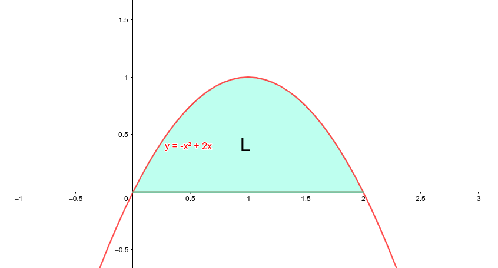

## Ukur kemampuanmu dengan menyelesaikan soal tentang luas daerah menggunakan integral
<!--
Kerjakan soal berikut di buku, kemudian jawaban dalam bentuk PDF diupload ke alamat https://bit.ly/Tugas1602. Tenggat waktu sampai 16 Februari 2022 pukul 21.00
> Hitunglah luas daerah yang dibatasi oleh:
  * kurva $y=-x^2+2x$ dan sumbu-$x$ untuk interval $0 \leq x \leq 2$ !
  * kurva $y=2-x^2$ dan sumbu $y=x$ !
  * kurva $y=4-x^2$, sumbu-$x$, garis $x=0$, dan $x=1$ !



Luas daerah yang dibatasi oleh kurva $y=-x^2+2x$ dan sumbu-$x$ untuk interval $0 \leq x \leq 2$ ! adalah \
$$  \begin{aligned}  L &= \int\limits_{0}^2 (-x^2+2x) dx \\\\  &= -(\frac{1}{2+1})x^{2+1}+(\cfrac{2}{1+1})x^{1+1}\rbrack_{0}^2 \\\\  &= -\left(\frac{1}{3} \right)x^{3}+\left(\cfrac{2}{2}\right)x^{2}\rbrack_{0}^2 \end{aligned} $$



* kurva $y=2-x^2$ dan sumbu $y=x$ !
* kurva $y=4-x^2$, sumbu-$x$, garis $x=0$, dan $x=1$ !

-->

Tentukan hasil dari integral berikut:
  * $\int (4x-1)(3x+2) dx$
  * $\int (2-x)(1-3x) dx$
  * $\int (3-2x^2)^2 dx$
  * $\int\limits_{0}^1 (10x^3+20x^5) dx$
  * $\int\limits_{2}^3 (x-2) dx$

Selamat mengerjakan!


